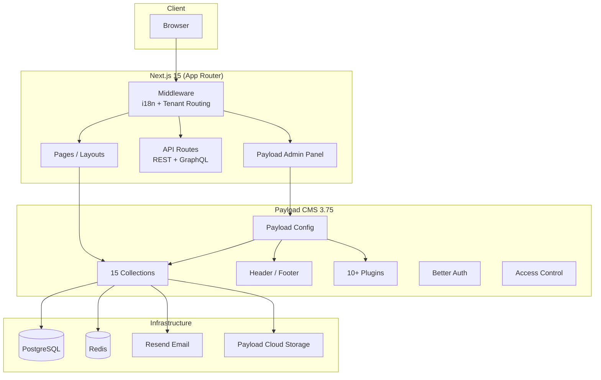
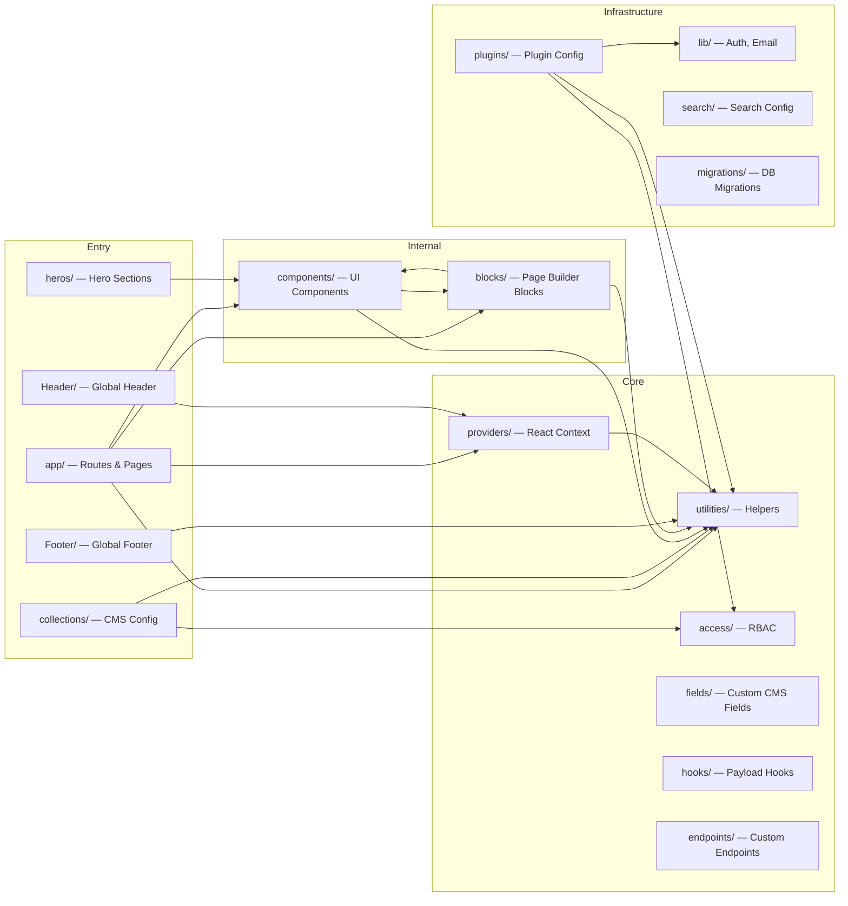
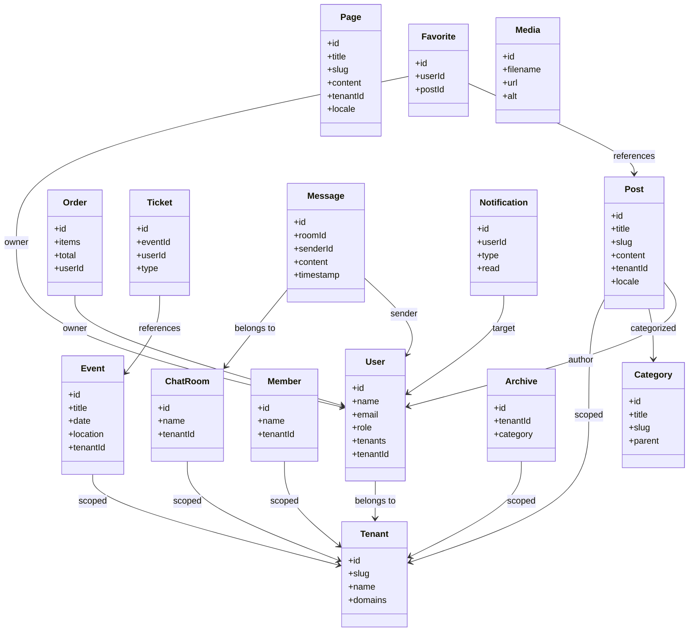
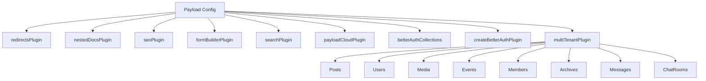
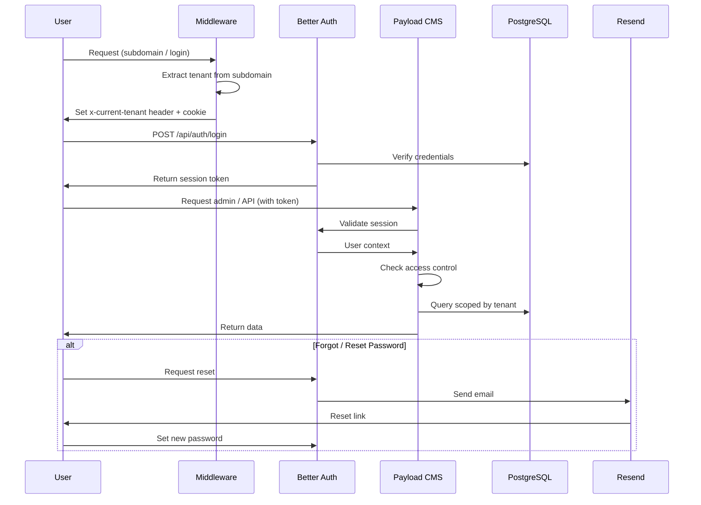
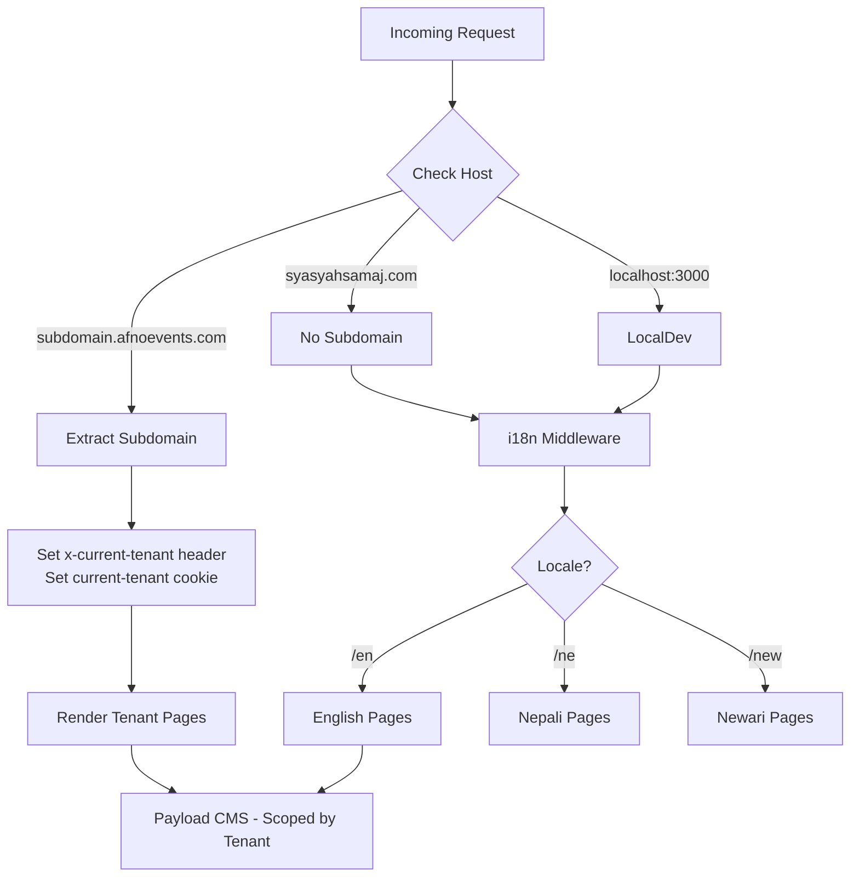

# Syasyah Samaj — Architecture

## Tech Stack

| Layer        | Technology                                      |
| ------------ | ----------------------------------------------- |
| Framework    | Next.js 15 (App Router)                         |
| CMS          | Payload CMS 3.75 (headless)                     |
| Database     | PostgreSQL (`@payloadcms/db-postgres`)           |
| Cache/Queue  | Redis (ioredis)                                 |
| Auth         | Better Auth + `payload-better-auth`             |
| Email        | Resend (`@payloadcms/email-resend`)              |
| i18n         | next-international (en, ne, new)                |
| UI           | Tailwind CSS, Radix UI, shadcn/ui, Framer Motion |
| Maps         | Leaflet + react-leaflet                         |
| Search       | `@payloadcms/plugin-search`                     |
| Storage      | Payload Cloud                                   |
| Language     | TypeScript                                      |

---

## High-Level Architecture



---

## Layers & Dependency Flow



---

## Collections (Data Model)



---

## Plugin Ecosystem



---

## Authentication & Authorization Flow



---

## Routing & Multi-Tenant Resolution



---

## Directory Structure

```
src/
├── access/          # RBAC definitions (admin, editor, anyone, etc.)
├── app/             # Next.js App Router
│   ├── (payload)/   # Payload admin UI
│   ├── [locale]/    # Internationalized frontend routes
│   └── api/         # Custom API endpoints
├── blocks/          # Page builder blocks (Content, Media, CTA, etc.)
├── collections/     # Payload CMS collections (15 total)
├── components/      # Reusable React components & shadcn/ui
├── context/         # React context (empty, available for future use)
├── endpoints/       # Custom Payload endpoints
├── fields/          # Custom Payload field types (slug, link, etc.)
├── Footer/          # Global Footer (Payload global config)
├── Header/          # Global Header (Payload global config)
├── heros/           # Hero section variants
├── hooks/           # Payload lifecycle hooks
├── lib/             # Auth, Email, external integrations
├── locales/         # i18n config (en, ne, new)
├── migrations/      # PostgreSQL migrations
├── plugins/         # Plugin configuration
├── providers/       # React context providers (Theme, HeaderTheme)
├── search/          # Search plugin config
└── utilities/       # Shared helpers (cn, merge, format, etc.)
```

---

## Key Design Decisions

| Decision | Choice | Rationale |
|----------|--------|-----------|
| CMS | Payload CMS 3.x | Headless, type-safe, self-hosted, great DX |
| Multi-tenancy | Plugin-based (shared DB, tenant field) | Isolates data by tenant without per-tenant DBs |
| Auth | Better Auth (external) | Decouples auth from CMS, supports OAuth/2FA |
| Database | PostgreSQL | Reliable, ACID, good with Payload |
| Cache | Redis | Session cache, rate limiting, pub/sub for chat |
| i18n | next-international | Lightweight, type-safe, good Next.js App Router support |
| UI Framework | Tailwind + Radix + shadcn/ui | Accessible, customizable, modern |
| Maps | Leaflet (self-hosted tiles) | Free, privacy-friendly, no API key required |
| File Storage | Payload Cloud | Integrated, simple, no extra setup |
